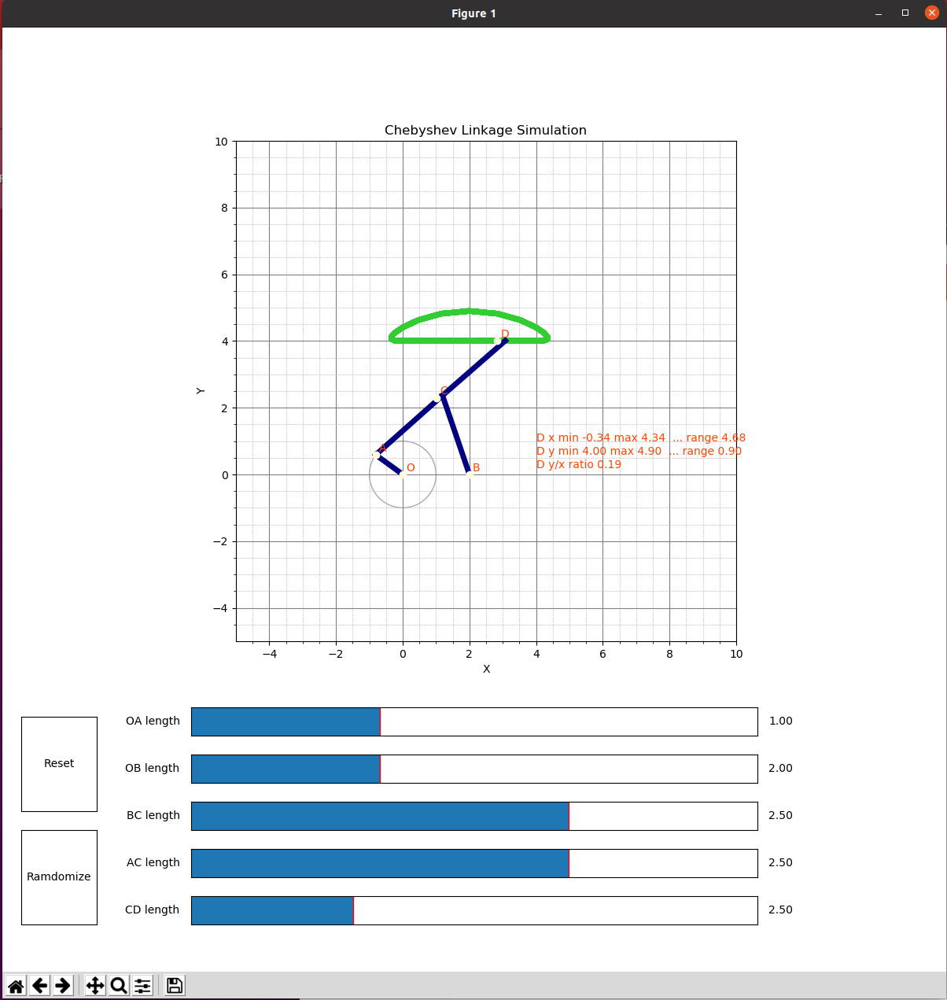

# Chebyshev Linkage Simulation

You can change the length of each linkage and simulate what happens as a result.



## Requirement

* python3
* numpy

## Usage

```bash
python3 chebyshev_linkage_simulation.py
```

# License
 
Chebyshev Linkage Simulation is under [MIT license](https://en.wikipedia.org/wiki/MIT_License).